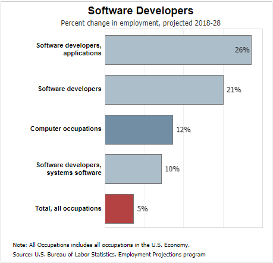
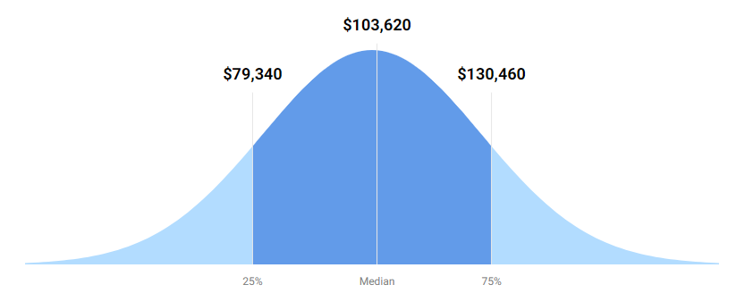

Hey thanks for coming by! Hope this page gets you interested in becoming a software engineer.

## Job Outlook

The need for software developers (engineers) is projected to grow [21 percent from 2018 - 2028](https://www.bls.gov/ooh/computer-and-information-technology/software-developers.htm#tab-6). With the ever growing need for new applications across multiple devices to modernizing of different industries, these skill sets are in demand.

There are so many different types of jobs and companies someone who has the skill set to program can work for. You can choose to work for a Fortune 500 company or a small company. A startup or start your own company. You can work within a tech company or an industry that is modernizing.

You can freelance or have a side hustle, depending on what you are interested in. It's easy to be a full time employee or a contractor. 

Being a software developer/engineer...the world is really your oyster. 

### Education

Getting a bachelors degree in Computer Science, Management Information Sytems, or Geographic Information Systems are usually requirements when applying for jobs. In addition, look for internship opportunity's to persue while in school. 

### Salary 
Pay is fairly high for [Software Developers](https://money.usnews.com/careers/best-jobs/software-developer/salary) with the average from 2018 being $103,620.

## Day in the life of a software engineer

There is no "average day" as a software engineer. I have tried to put together what a single day on the job might entail.

### Morning
Usually will get to the office or login from home between 8 - 9am. Most schedules are flexible due to the nature of our work. We are not based solely on product output. It's a creative process and sometimes it takes a bit to solve the problem at hand. We have a daily stand-up meeting where we all talks about what we did the day before and what we are going to work on today. 
Where I work, we have embraced [Agile Software Development](https://agilemanifesto.org/). After the meeting, I'll start diving in on a bug that needs to be fixed or work on a feature for the product at hand. 

### Mid-day
With a pretty flexible schedule, lunch usually happens whenever it's time for a brain break. I'll usually step out for a walk and lunch with friends/co-workers. After lunch, come back and dive into some more coding and try to get into a good flow state.

### Mid-afternoon
Coming out of a good flow state means, time for a break! I like play a little guitar or games to unwind a bit before firing back up. I'll usually spend the rest of the day working on some learning and proof of concepts to get our product to the next level technologically. 
Software development moves so rapidly, having learning time is an integral part of your day.  

### Evening
I"ll usually sign off around 5 - 6 to spend time with family and unwind. Usually I may fire up my laptop if a problem needs assistance or if I have something in my head I need to get down.  

## Resources

* [Minecraft Hour of Code Tutorials](https://code.org/minecraft)
* [Middle to High School Tutorials](https://code.org/student/middle-high)
* [Scratch: Create stories, games, and animations](https://scratch.mit.edu/)
* [Python Coding for Youth](https://www.udemy.com/course/teach-your-kids-to-code/)
* [Free Code Camp](https://www.freecodecamp.org/)

### About Me

* **Ed Briggler**
* St. Joseph, Class of 2002
* [LinkedIn](https://www.linkedin.com/in/edwardbriggler/)
* [Github](https://github.com/lemonprogis)
